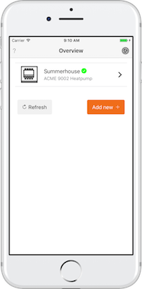
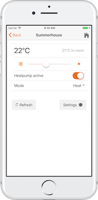
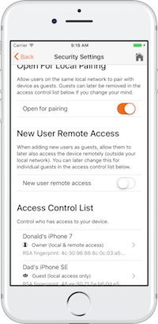

# Ionic Starter for Nabto IoT / AppMyProduct

This [Ionic](http://ionicframework.com) Starter is the first [AppMyProduct](https://www.appmyproduct.com) sample app. It contains everything to build a production ready IoT app to remote control your own product:

* Device management through local discovery and bookmarks for later access
* RSA fingerprint based pairing of local devices with app for secure remote access
* On-device access control and user management (self-contained, no need for any central configuration)
* Example page for heating control to demonstrate actual device interaction - can be replaced with specific remote control for your IoT scenario
* Takes full benefit of the Nabto framework to ensure secure, high performance remote access

<p align="center">



</p>

Only a single page in this template app is product specific - the `./src/pages/vendor-heating` page. The remaining app pages are generally applicable for your custom scenario, i.e. to handle pairing, device maintenance, security settings etc. See the section "Customization" below on how to use the app as starting point your specific domain (e.g., to control smart lock or lights).

The app uses the [Nabto Cordova Plugin](https://github.com/nabto/cordova-plugin-nabto) and adds a simpler to use TypeScript and Promise based wrapper (`./src/app/nabto.service.ts`).

To try the app, follow the instructions below.

To setup a stub device to interact with (and to use as basis for your own device integration), build and run the [AppMyProduct Heat Control stub](https://github.com/nabto/appmyproduct-device-stub). To enable the device for remote access, this requires an [AppMyProduct account](https://www.appmyproduct.com).

# iOS

## Quick start

On a typical developer workstation, an app can be built with the following steps from this directory:

```ShellSession

git clone https://github.com/nabto/ionic-starter-nabto.git

sudo ./scripts/ios-install.sh
./scripts/ios-build.sh
./scripts/ios-emulate.sh
```

See more detailed outline below. Also, we have added [Fastlane](https://fastlane.tools/) support so an alternative quick start is to do adaptation in `fastlane/Fastfile` and simply run `fastlane install`.


## Install

1. Node and NPM must be installed (either through your package manager or from [nodejs.org](https://nodejs.org/en/download/)).
2. Xcode must be installed
3. install cordova: `sudo npm install cordova -g`
4. install ionic: `sudo npm install ionic -g`
5. to enable running on device: `sudo npm install -g ios-deploy --unsafe-perm=true`
6. to enable running on simulator: `sudo npm install -g ios-sim@latest`
7. add the iOS Cordova platform: `ionic cordova platform add ios`

Odd problems during deploy / run can sometimes apparently be remedied by uninstalling `ios-deploy` and `ios-sim` and re-installing. Specifically as of June 2017, a problem is often seen with a Cordova javascript error when launching the simulator. [The problem can be remedied](https://stackoverflow.com/questions/42350505/error-cannot-read-property-replace-of-undefined-when-building-ios-cordova) by running `npm install ios-sim@latest` in `platforms/ios/cordova`.


## Build

Only necessary first time and when changing native plugin configuration:

```ShellSession
ionic cordova prepare ios

# fix linker problem when using Nabto lib
echo 'OTHER_LDFLAGS = -force_load $(BUILT_PRODUCTS_DIR)/libCordova.a -lstdc++' >> \
  platforms/ios/cordova/build.xcconfig

ionic cordova build ios
```


## Run

The following requires the device to be connected with USB and screen must be unlocked:

```ShellSession
ionic cordova run ios --livereload -c -s --debug --device
```

or run on in the simulator:

```ShellSession
ionic cordova emulate ios --livereload -c -s --debug
```

Live reload is enabled, allowing you to instantly observe changes in HTML app source files (`*.ts, *.html. *.scss`). While very handy during development, this also means the app will not work on a device that is disconnected from the workstation or if the ionic server is stopped. So if you have problems with the app hanging after start, remove the `--livereload` parameter.

The first time the app is attempted to be run, an error is observed about developer/provisining profile - open the project in xcode and select a profile (also see the troubleshooting section):

```ShellSession
./scripts/ios-open-xcode.sh
```

Subsequently, the run command above can be used.

Note! If using Xcode 10, see the troubleshooting guide below if build or run fails.

# Android

## Quick start

On a typical developer workstation, an app can be built with the following steps from this directory:

```ShellSession
sudo ./scripts/android-install.sh
./scripts/android-build.sh
./scripts/android-emulate.sh
```

Note that for the last step, an Android emulator image must have been configured with adb.

## Install

1. Node and NPM must be installed (either through your package manager or from [nodejs.org](https://nodejs.org/en/download/)).
2. Android Studio must be installed and an emulator device configured
3. install cordova: `sudo npm install cordova -g`
4. install ionic: `sudo npm install ionic -g`
5. add the Android Cordova platform : `ionic platform add android@latest`

Note that at least version 6.1.1 of cordova-android is necessary as indicated if using Android 7 or newer (otherwise you will see an app signing error).

## Build

Only necessary first time and when changing native plugin configuration:

```ShellSession
ionic cordova prepare android
ionic cordova build android
```

## Run

The following requires the device to be connected with USB:

```ShellSession
ionic run android --livereload -c -s --debug --device
```

or run using an already configured emulator (note: the emulator is not very useful as it only supports GSM, meaning that bootstrapping through local device discovery does not work):

```ShellSession
ionic emulate android --livereload -c -s --debug
```

Live reload is enabled, allowing you to instantly observe changes in HTML app source files (`*.ts, *.html. *.scss`). While very handy during development, this also means the app will not work on a device that is disconnected from the workstation or if the ionic server is stopped. So if you have problems with the app hanging after start, remove the `--livereload` parameter.

# Customization

You can use most of the app as-is for your own specific scenario (if the PPKA security model fits your needs, see section 8 in [TEN036 Security in Nabto Solutions](https://www.nabto.com/downloads/docs/TEN036%20Security%20in%20Nabto%20Solutions.pdf) for details).

## Setting up your own git repo

To stay uptodate with changes in the starter app, it is recommended to work in a
[fork](https://help.github.com/articles/fork-a-repo/) of the starter app repo. If you customize the
app as elaborated in the following sections, you can merge in general changes to the app without
conflicts:

```ShellSession
git pull https://github.com/nabto/ionic-starter-nabto.git master
```

See the [github
documentation](https://help.github.com/articles/merging-an-upstream-repository-into-your-fork/) for
further details.

## Basics

The basic theme of the app can be changed through `./src/theme/variables.scss`, see [the Ionic documentation](https://ionicframework.com/docs/theming/theming-your-app/) for details.

Product specific customization takes place through `./src/app/customization.class.ts`. It allows you to setup the page the app should navigate to when a device is accessed instead of the default heating app. It also specifies the Nabto RPC interface that is supported by this app:

```TypeScript
export class Customization {
  // name of page to navigate to from overview (the essential page of the app)
  public static vendorPage: string = 'VendorHeatingPage';

  // supported device interface - only interact with devices that match exactly this
  public static interfaceId: string = '317aadf2-3137-474b-8ddb-fea437c424f4';

  // supported major version of the device interface - only interact with devices that
  // match exactly this
  public static interfaceVersionMajor: number = 1;

  // supported minor version of the device interface - only interact with devices that
  // match at least this
  public static interfaceVersionMinor: number = 0;
}

```

Replace `vendorPage` with the name of the target page.

The `interfaceId` and `interfaceVersionMajor` must match exactly what is implemented by the
device. The device must implement at least `interfaceVersionMinor` version of the interface. See
below for details.

## RPC interface configuration

With the current Nabto RPC implementation, the interface checking is implemented at the application
level, ie by convention. The app expects the device to implement the following Nabto RPC function:

```XML
  <!-- interface id version info that clients must match -->
  <query name="get_interface_info.json" id="0">
    <request>
    </request>
    <response format="json">
      <parameter name="interface_id" type="raw"/>
      <parameter name="interface_version_major" type="uint16"/>
      <parameter name="interface_version_minor" type="uint16"/>
    </response>
  </query>
```

Implemented for instance as:

```C
    ...
    static const char* device_interface_id_ = "317aadf2-3137-474b-8ddb-fea437c424f4";
    static uint16_t device_interface_version_major_ = 1;
    static uint16_t device_interface_version_minor_ = 0;

    ...
    switch (request->queryId) {
    case 0:
        // get_interface_info.json
        if (!write_string(query_response, device_interface_id_)) return AER_REQ_RSP_TOO_LARGE;
        if (!unabto_query_write_uint16(query_response, device_interface_version_major_)) return AER_REQ_RSP_TOO_LARGE;
        if (!unabto_query_write_uint16(query_response, device_interface_version_minor_)) return AER_REQ_RSP_TOO_LARGE;
        return AER_REQ_RESPONSE_READY;
```

As mentioned above, `device_interface_id_` and `device_interface_version_major_` must match exactly
what is expected by the client to allow the client to invoke the device. The minor version
`device_interface_version_minor_` must be at least the version expected by the client.


## Icons and graphics

The device decides the name of the icon to show for the specific device type in the overview and
discovery screens, served in the `get_public_device_info.json` query by the device. The icon must be bundled with
the app (in the `src/assets/img` folder).

Base images to use for generation of icons for the app store and on the client device are located in the `resources` project folder:

* icon.png: a 1024x1024 png file
* splash.png: a 2732x2732 png file - your actual image should fit within a 1200x1200 square in the middle, the image is then center cropped to match the various necessary device dimensions (use [this psd template](https://code.ionicframework.com/resources/splash.psd) to get the dimensions right).

Run `ionic cordova resources` to automatically generate the large amount of individual device specific images and icons based on the above 2 files.

See the [Ionic documentation](https://ionicframework.com/docs/cli/cordova/resources/) on `ionic cordova resources` for further details.

# Troubleshooting

## General

### Provisioning errors on iOS

Often you will get errors like the following:

<pre>
Error Domain=IDEProvisioningErrorDomain Code=9 ""AMPHeat.app" requires a provisioning profile." UserInfo={NSLocalizedDescription="AMPHeat.app" requires a provisioning profile., NSLocalizedRecoverySuggestion=Add a profile to the "provisioningProfiles" dictionary in your Export Options property list.}
</pre>

One way to minimize trouble in this regard is to manage certificates using [Fastlane](https://fastlane.tools/), we have added templates to make this reasonably simple.

But even with Fastlane you may occasionally run into head scratching oddities where you google and find a few hundred hints like "try this version of this combined with that version of that" or "it worked for me to downgrade to version x.y.z and manually change this XML file blahblah". In addition to throwing a dead cat across your shoulder at next full moon, we have noticed that simply re-installing the iOS cordova platform often fixes the oddest problems:

<pre>
$ cordova platform rm ios
$ cordova platform add ios@latest
</pre>

### App crashes

If you obtain crash reports where you can see Nabto is active during a crash, it is tempting to
focus all efforts towards debugging some Nabto related aspect of the app. However, due to background
processing in the Nabto SDK, you will often see traces of Nabto in crash reports - even if Nabto
does not play a role in causing the crash. So a good first attempt is to disable the Nabto plugin if
possible and see if this affects the app crash.

If not possible to disable Nabto or if it does not help, try to simplify the app complexity and
e.g. remove other plugins to the extent possible. Ideally when you need assistance from Nabto
support, see if you can reproduce your problem with as few as possible modifications to the standard
Nabto apps and include or reference a repo with such a simple modified app in your error report.

### Blank screen stuck at app startup

This has been observed if using an app deployed with the
`--livereload` parameter without being able to reach the live reload
server. So the solution is to either run the app without
`--livereload` or start the server again (see section "Running" above).

It can also be caused by some critical errors in the app at startup -
with modern Ionic tools, this should no longer be an issue though,
such errors would be expclitly reported. If you still observe the
problem, it might yield useful information to attach the Safari web
debugger and view the console.

### Blank screen for 5-10 seconds at app startup

This problem is often observed when using developer builds - the
longer initial startup time is a good tradeof for shorter subsequent
build cycles where AOT optimizations are not performed.

With a production build (`ionic run --prod`), the startup time is
optimized greatly, reducing the initial delay to an insignificant short
time.

### Problems generating icons

When using the [Ionic resources
tool](http://ionicframework.com/docs/cli/icon-splashscreen.html)
(`ionic resource --splash` and `ionic resource --icon`), sometimes
really odd errors about a server upload are seen: The tool uploads
icon and splash base images to a server to slice and dice to match the
individual platform requirements. When the server chokes on input, it
just says "upload error".

So check your input .png files if this error is observed: Compression
should be enabled, interlacing must be disabled.

### Build problems

Make sure you have the latest versions of npm and nodejs - e.g., on linux (as root):

```
apt-get update && apt-get install npm
npm install npm -g
curl -sL https://deb.nodesource.com/setup_6.x | bash -
apt-get install nodejs
```
You may need a symbolic link from nodejs to node:

```
ln -s /usr/bin/nodejs /usr/bin/node
```

## iOS

### Xcode 10 build problems

If using Xcode 10, there is currently a problem with Ionic/Cordova so try using the legacy build
option if the instructions above and/or the scripts in the `scripts` folder fails:

```
cordova run ios --buildFlag='-UseModernBuildSystem=0' --target iPad-Air-2
```

Note that Cordova is invoked directly with this command to pass in the build flag option, unknown how this is done using the Ionic cli.


### Linker error

A linker error like the following means you missed a step in the installation procedure:

```
ld: symbol(s) not found for architecture arm64
clang: error: linker command failed with exit code 1 (use -v to see invocation)
Showing first 200 notices only
Showing first 200 errors only


** ARCHIVE FAILED **


The following build commands failed:

	Ld /Users/nabto/Library/Developer/Xcode/DerivedData/AMP_Heat-befzuqlqcagkojfbuvacxskkiqvh/Build/Intermediates/ArchiveIntermediates/AMP\ Heat/IntermediateBuildFilesPath/AMP\ Heat.build/Debug-iphoneos/AMP\ Heat.build/Objects-normal/arm64/AMP\ Heat normal arm64
```

You need to update the linker settings to force load the Cordova library:

```bash
echo 'OTHER_LDFLAGS = -force_load $(BUILT_PRODUCTS_DIR)/libCordova.a -lstdc++' >> \
  platforms/ios/cordova/build.xcconfig
```

### Signing error

The first time you attempt to run the app, you will see the following error:

```
Error: Error code 65 for command: xcodebuild with args: ..." ... " Signing for "AMP Heat" requires a development team. Select a development team in the project editor"
```

Before the app can be run, a team must be selected for the project in XCode. If you are new to iOS app development, please see section "iOS Devices" in the [Ionic deployment docs](https://ionicframework.com/docs/v2/setup/deploying) for further instructions.

To fix, open the XCode project:

```ShellSession
./scripts/ios-open-xcode.sh
```

Click the project name in the left pane ("AMP Heat" per default) and the corresponding target that appears. On the "General" tab in the "Signing" section, pick a team and a profile.


## Android

### Signing error on Android 7+

Use at least Android 6.1.1 when deploying for Android 7+:

```ShellSession
ionic platform add android@6.1.1
```
### Android license not accepted
If you have Android Studio installed, open the sdk manager from Tools->Android->SDK manager and accept licenses as needed. If you only have the Android command line sdk installed, update the SDK manually with:
```
android update sdk --no-ui --all --filter build-tools-25.0.1,android-25,extra-android-m2repository
```
and accept license agreement when prompted.

### ANDROID_HOME not found
set the android environment variables manually:
```
export ANDROID_HOME=/path/to/android-sdk
export PATH=${PATH}:$ANDROID_HOME/tools:$ANDROID_HOME/platform-tools
```

### Hints for misc errors observed

HAXM install errors on macOS when preparing emulator: Upgrade bash (even if using brew's bash).

“HAX is not working and emulator runs in emulation mode”: Re-create
emulator image and be careful to always specify the same amount of
memory to use when prompted and specifying on commandline.

Android SDK license errors: Make sure you have accepted the license
for the specific version of the SDK that Ionic uses if multiple
versions are installed (problems observed as Ionic did not support the
newest SDK which was the one that had the license accepted).
